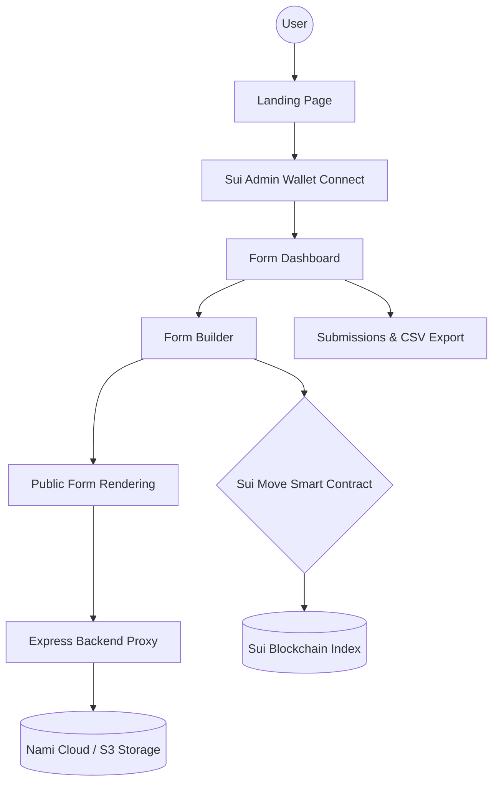

# Walrus Form - Documentation & Architecture

## 🗺 System Map

## 📂 Project Structure

- `server/`: Backend Express Server.
  - `index.ts`: API endpoints for proxying schema requests and managing walletless response submissions. Falls back to local filesystem storage in `./storage/` if S3 parameters are omitted.
- `src/pages/`: Main application views.
  - `Landing.tsx`: Responsive marketing landing page (supports dynamic dark/light mode contrast).
  - `Dashboard.tsx`: Central hub for admins to view their forms, clone/delete entries, and see submissions (Analytics tab removed for streamlined flow).
  - `Builder.tsx`: Drag-and-drop form creator with interactive properties editor, validation constraints, and live theme customizer.
  - `Results.tsx`: Submissions viewer table featuring Excel/Google Sheets-compatible CSV export.
  - `PublicForm.tsx`: Unified form renderer with synchronized theme styles (mode-specific card styles, high-contrast inputs, local relative backgrounds in preview frame, fallbacks for glass mode).
- `src/store/`: State management using Zustand.
  - `useFormStore.ts`: Form schemas, indexed Sui query resolution, and response queries.
  - `useAuthStore.ts`: Handles wallet-connected admin authentication.
  - `useThemeStore.ts`: Global dark/light/glass UI theme.
- `src/services/`: Integration layer.
  - `walrus.ts`: Standardizes JSON requests to Express proxy API endpoints.

## 💾 Data Flow

### 1. Form Creation & Indexing
1. The Admin wallet creates a form in `Builder.tsx`.
2. Clicking **Publish** sends the schema payload to the backend proxy via `walrus.ts` (`POST /api/blob`).
3. The backend proxy saves the JSON payload to **Nami Cloud** (AWS S3) using the Form ID as the storage key.
4. Once stored, the frontend prompts the Admin to sign a Sui transaction (`register_form` in our Move contract), indexing the Form ID (`blob_id`), title, description, and admin address on-chain.

### 2. Walletless Form Submission (Public Users)
1. A public visitor opens a published link `/f/:id`. The page queries `GET /api/blob/:id` directly from the backend proxy (no wallet connection or Sui gas required).
2. The user fills out the form.
3. Submitting the form calls `POST /api/form/:id/response` on the backend proxy.
4. The proxy assigns a unique UUID response key, saving it to **Nami Cloud** (or local disk cache) under `response:${formId}:${responseId}`.

### 3. Reviewing Submissions (Admin)
1. The Admin connects their registered wallet on `Auth.tsx`. The contract whitelist confirms their admin permission.
2. The Admin navigates to `/analytics/:id` (Results).
3. The page requests `GET /api/form/:id/responses` from the proxy.
4. The proxy returns all responses in a clean list, which the Admin can view, filter, or export to CSV.

## 🛠 Extension Guide

To add a new field type:
1. Update `FieldType` Union in `src/store/useFormStore.ts`.
2. Add input rendering logic in `FieldRenderer` and customize styles in `getFieldBaseClasses` inside `src/pages/PublicForm.tsx`.
3. Add configuration properties UI under `FieldPropertiesPanel` in `src/pages/Builder.tsx`.
