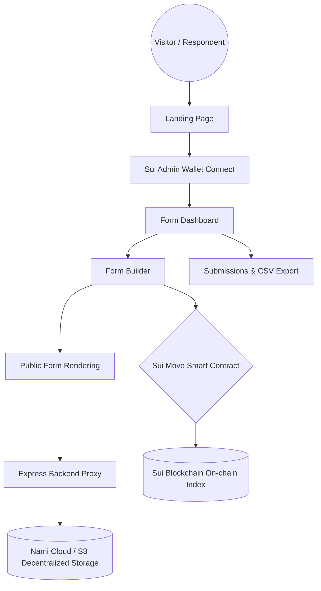

# 🦦 Walrus Form - Premium Decentralized Form Builder

Walrus Form is a modern, high-performance, and absolutely secure form builder that operates entirely on **Walrus** (a decentralized storage network developed by Mysten Labs) via the **Nami Cloud** branding, and is anchored by the **Sui blockchain** for state indexing and authorization.

Crafted with a premium **"Apple Glass" (glassmorphism)** design, Walrus Form features fluid dark/light transitions, high-contrast inputs, responsive card styling, and an intuitive, real-time live preview panel.

---

## ⚡ Core Architecture Map



---

## ✨ Features

- **Decentralized Storage (Nami Cloud / Walrus)**: Form structures, configuration properties, and user submissions are stored securely as decentralized blobs.
- **Gasless & Walletless Response Submission**: Public form respondents can view, complete, and submit forms completely free of charge. No wallet, Sui browser extensions, or gas fees are required for the general public.
- **Smart Contract Governance (Sui Move)**: Admin authentication, form publication rights, metadata indexing, and form deletion permissions are governed by smart contracts on the Sui blockchain.
- **Unified Live Builder Preview**: Real-time theme visualizer and structure renderer integrated right in the builder canvas for precise form design.
- **Decentralized File Uploads**: Built-in support for uploading images, videos (<10MB), and other attachments directly to Nami Cloud.

---

## ☁️ Nami Cloud Setup & Integration (Decentralized S3)

> [!IMPORTANT]
> **What is Nami Cloud?**
> Nami Cloud is an S3-compatible cloud interface that runs directly on top of the **Walrus** decentralized storage protocol.
> It gives you **decentralized, redundant, censorship-resistant storage** guarantees while allowing you to use standard, well-matured developer tools (like the AWS S3 SDK and command-line clients).

### How to Register and Obtain S3 Keys:

1. **Sign Up**: Navigate to the [Nami Cloud Dashboard](https://nami.cloud) (or the official console provider) and register a developer account.
2. **Create a Bucket**: 
   - Go to **Buckets** tab in the dashboard.
   - Click **Create Bucket**, name it (e.g., `walform-storage`), and select your desired storage class.
3. **Generate Developer Access Keys**:
   - Go to **Developer Settings** or **Access Keys** section in your dashboard.
   - Click **Create Access Key**.
   - Copy the generated credentials safely:
     - **Access Key ID**: Used to authenticate requests.
     - **Secret Access Key**: Your private signing key.
4. **Endpoint URL**: Note down your S3 endpoint (typically Nami Cloud uses an S3-compatible URL like `https://s3.nami.cloud` or standard AWS gateway endpoints depending on your region).

---

## 🛠 Local Setup & Installation

### 1. Environment Configuration (`.env`)

Create a `.env` file in the root directory. Copy the contents below and fill in your details:

```env
PORT=3001
VITE_API_URL=http://localhost:3001

# Sui Network & Move Package Configuration
VITE_SUI_NETWORK=mainnet
VITE_SUI_PACKAGE_ID=0x... # The deployed Move Package ID on Sui

# Nami Cloud (AWS S3-Compatible) Configuration
# Note: If these AWS keys are omitted, the Backend Proxy automatically falls back 
# to a local secure filesystem cache located in server/storage/
AWS_ACCESS_KEY_ID=your_nami_cloud_access_key_id
AWS_SECRET_ACCESS_KEY=your_nami_cloud_secret_access_key
AWS_REGION=ap-southeast-1
AWS_S3_BUCKET=your_nami_cloud_bucket_name
AWS_S3_ENDPOINT=https://s3.ap-south-1.amazonaws.com # Optional: Custom S3-compatible Endpoint for Nami Cloud
```

### 2. Launching the Backend Proxy

The Express server handles secure S3 API interactions, media caching, and forwards submissions without exposing admin secrets to the client.

```bash
# Install dependencies
npm install

# Start Express S3 Proxy (Runs on port 3001)
npm run backend
```

### 3. Launching the Frontend Application

Open another terminal and start the Vite React development server:

```bash
# Start Frontend Developer server (Runs on port 3000)
npm run dev
```
Navigate to [http://localhost:3000](http://localhost:3000) to start building forms!

---

## 📦 Production Deployment

### Option 1: Vercel (Recommended - Full-Stack)

Vercel can deploy the frontend as optimized static assets and host the Express proxy server as serverless Node.js endpoints (configured via `vercel.json` and `api/index.ts`).

1. Ensure `vercel.json` and `api/index.ts` exist in your project root.
2. Link your Github Repository to [Vercel Dashboard](https://vercel.com).
3. Set your **Environment Variables** in Vercel settings:
   - `AWS_ACCESS_KEY_ID`
   - `AWS_SECRET_ACCESS_KEY`
   - `AWS_REGION`
   - `AWS_S3_BUCKET`
   - `AWS_S3_ENDPOINT`
   - `VITE_SUI_PACKAGE_ID`
   - `VITE_SUI_NETWORK`
4. Click **Deploy**. Vercel will build the frontend assets, set up standard caching, and expose serverless backend endpoints automatically!

---

### Option 2: Walrus Site (Fully Decentralized Frontend)

You can host the React frontend static assets directly on the decentralized web as a **Walrus Site**. Because a Walrus Site runs on client-side sandboxed logic, you will need to point the storage API endpoint to an external backend proxy server (such as your Vercel URL from Option 1).

#### Step 1: Build the Static Frontend
Update the `.env` variable `VITE_API_URL` to point to your live Vercel/Node API (e.g. `https://your-app.vercel.app`), then compile the optimized bundle:
```bash
npm run build
```
This outputs all final optimized assets into `dist/`.

#### Step 2: Publish using Walrus CLI Site Builder
1. Install Mysten Labs' `site-builder` command-line utility.
2. Initialize your decentralized site package:
   ```bash
   site-builder init --network testnet
   ```
3. Upload the build directory to the Walrus network:
   ```bash
   site-builder publish dist
   ```
The CLI tool will print a decentralized, censorship-resistant address:
`https://[walrus-site-object-id].walrus.site`

---

## 🛡 Move Smart Contract Deployment (Sui)

To redeploy or update the governance index registry on SUI:

1. Navigate to the contract directory:
   ```bash
   cd contracts/blob_index
   ```
2. Build and publish via Sui CLI:
   ```bash
   sui client publish --gas-budget 20000000
   ```
3. Save the returned `Package ID` and update `VITE_SUI_PACKAGE_ID` in your `.env`.
4. As the Package Owner, you can whitelist additional admin addresses by calling the `register_admin` entrypoint function through a block explorer (like Suiscan) or custom automation scripts.
